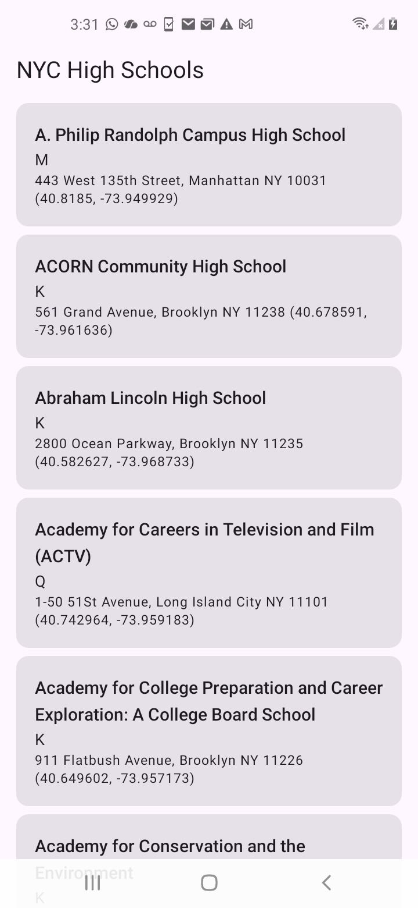
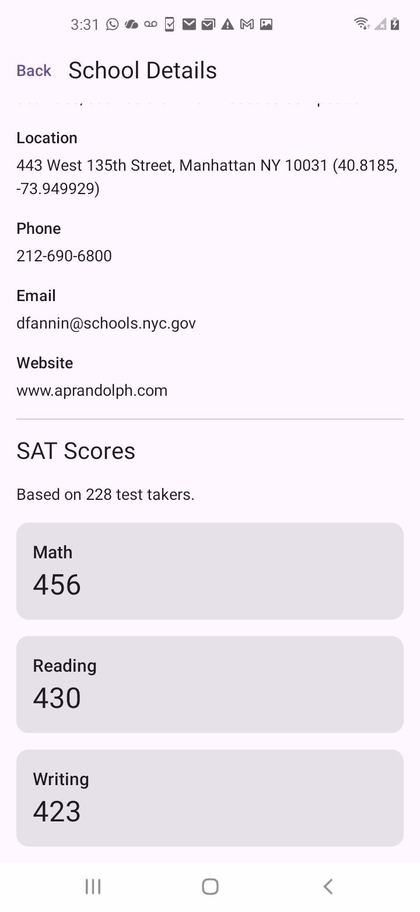

# NYC High Schools

A native Android app that lets users browse NYC high schools and view available SAT scores for each school.

## What it does

- Displays a list of NYC high schools.
- Opens a detail page when a school is selected.
- Shows school information including location, phone number, email, website, and overview.
- Displays available SAT Math, Reading, and Writing scores.
- Handles loading, missing data, and network errors.
- Caches downloaded school and SAT data locally so the app can display saved results after data has been loaded.

## Built With

- Kotlin
- Jetpack Compose
- MVVM
- Retrofit and Gson for API requests
- Hilt / Dagger for dependency injection
- Room for local data storage
- Kotlin Coroutines and Flow
- Navigation Compose
- Mockito and JUnit for unit testing
- Compose UI testing

## Architecture

The app follows a simple MVVM and repository-based structure:

```text
Compose UI → ViewModel → Repository → Retrofit / Room
```

- **Compose UI** displays the school list and school details.
- **ViewModels** manage screen state, loading, and errors.
- **Repository** coordinates data from the API and local database.
- **Retrofit** retrieves live data from NYC Open Data.
- **Room** stores downloaded results locally.

## Data Sources

The app uses public NYC Open Data datasets:

- [2017 DOE High School Directory](https://data.cityofnewyork.us/Education/2017-DOE-High-School-Directory/s3k6-pzi2)
- [High School Directory JSON API](https://data.cityofnewyork.us/resource/s3k6-pzi2.json)
- [SAT Results](https://data.cityofnewyork.us/Education/SAT-Results/f9bf-2cp4)
- [SAT Results JSON API](https://data.cityofnewyork.us/resource/f9bf-2cp4.json)

Schools and SAT scores are connected using each school’s DBN identifier.

> Note: The provided SAT dataset contains school-level results from 2012, so SAT information is not available for every school.

## Running the Project

1. Clone this repository.
2. Open it in Android Studio.
3. Allow Gradle to sync dependencies.
4. Connect an Android device or start an emulator.
5. Run the app.

An internet connection is needed to load data from the NYC Open Data API. Once data is loaded, it is stored locally with Room.

## Testing

The project includes:

- A Mockito/JUnit unit test for the repository data flow.
- A Compose instrumented UI test.

To run tests, right-click a test class or method in Android Studio and select **Run**.

## Screenshots

### School List



### School Details and SAT Scores


